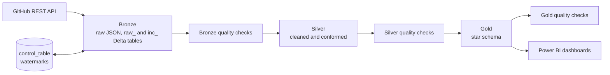

# GitHub Engineering Analytics Lakehouse

An end-to-end data platform on **Databricks** that tracks engineering activity across seven of Microsoft's largest open-source projects. It ingests data from the GitHub REST API, refines it through a **Medallion architecture** (Bronze, Silver, Gold) on **Delta Lake**, validates every layer with automated quality checks, and serves a **star schema** to **Power BI**.

> **Scale:** 400K+ commits and 190K+ pull requests, with history going back to each project's first commit (as far back as 2010 for the .NET runtime).

---

## Table of contents

- [Why this project](#why-this-project)
- [Architecture](#architecture)
- [Data sources](#data-sources)
- [Pipeline design](#pipeline-design)
- [Data model (Gold layer)](#data-model-gold-layer)
- [Data quality](#data-quality)
- [Dashboards](#dashboards)
- [Repository structure](#repository-structure)
- [Getting started](#getting-started)
- [Tech stack](#tech-stack)
- [Lessons learned](#lessons-learned)

---

## Why this project

Engineering leaders ask questions like: *How long does a pull request take to merge? Who contributes the most? How does activity change across the year?* Answering them needs more than a one-off script. It needs a pipeline that can run every day, survive API limits and partial failures, avoid re-downloading history, and expose a clean model for analysts.

This project covers both sides of that problem:

- **Data engineering:** ingestion, incremental loading, orchestration, and data quality.
- **Analytics engineering:** dimensional modeling and business metrics, delivered through BI dashboards.

## Architecture



The whole flow runs as a scheduled **Databricks Workflow**, and each layer is followed by its own quality gate:

`Bronze_Layer` → `Bronze_Quality_Checks` → `Silver_Layer` → `Silver_Quality_Checks` → `Gold_Layer` → `Gold_Quality_Checks`

## Data sources

Seven open-source projects, pulled through the GitHub REST API:

| Project | Repository |
|---|---|
| VS Code | `microsoft/vscode` |
| TypeScript | `microsoft/TypeScript` |
| PowerToys | `microsoft/PowerToys` |
| Windows Terminal | `microsoft/terminal` |
| PowerShell | `PowerShell/PowerShell` |
| .NET runtime | `dotnet/runtime` |
| ASP.NET Core | `dotnet/aspnetcore` |

For each repository, six endpoints are extracted: `repo_data`, `languages`, `commits`, `contributors`, `pull_requests`, and `releases`.

Row counts in the incremental tables after the last full validation run (October 3, 2026):

| Project | Commits | Pull requests |
|---|---:|---:|
| VS Code | 166,874 | 67,891 |
| .NET runtime | 129,358 | 57,231 |
| ASP.NET Core | 57,558 | 24,046 |
| TypeScript | 39,501 | 19,736 |
| PowerShell | 11,575 | 10,967 |
| PowerToys | 9,758 | 8,779 |
| Windows Terminal | 5,048 | 5,439 |

## Pipeline design

### 1. Bronze: ingestion

- API responses are written as JSON Lines files into a Unity Catalog **Volume**, then loaded into `raw_<repo>_<endpoint>` Delta tables with an `ingested_at` timestamp.
- Requests **retry with backoff** on rate limits and transient server errors (403, 429, 500, 502, 503).
- The GitHub token is stored in a **Databricks secret scope** and read at runtime. No credentials live in the code.

### 2. Incremental loading

Re-downloading hundreds of thousands of records on every run is wasteful, so loading is incremental:

- A **control table** (`bronze.control_table`) keeps one row per pipeline (`pipeline_name`, `last_watermark`, `updated_at`), for the commits and pull requests of each project.
- Each run reads the watermark, pulls only newer data from the API, and **merges** it into `inc_<repo>_<endpoint>` tables with Delta `MERGE` (keyed on `sha` for commits and `id` for pull requests). Duplicates are removed, and existing rows are updated.
- The watermark **advances only after the merge succeeds**, so a failed run never skips data.

The first full load took about 3.5 hours. After that, runs fetch only what is new.

### 3. History backfill

On the first run, a commits pull can stop short of a repository's real beginning. The extraction therefore compares the oldest commit it received with the repository's creation date, and if the gap is large it runs a second pass for the missing older window. Quality checks later confirm that every project's history reaches back before 2024.

### 4. Silver and Gold

Silver cleans and conforms the data. Gold reshapes it into a star schema built for BI. Both layers are gated by their own quality-check notebooks before the next stage starts.

## Data model (Gold layer)

A star schema with two fact tables, ten dimensions, and three bridge tables for many-to-many relationships.

| Type | Tables |
|---|---|
| **Facts** | `fact_pull_requests`, `fact_commit` |
| **Dimensions** | `dim_repo`, `dim_user`, `dim_date`, `dim_timestamp`, `dim_label`, `dim_flags`, `dim_author_association`, `dim_base_ref`, `dim_milestone`, `dim_milestone_state_history` |
| **Bridges** | `label_pr`, `assignee_pr`, `reviewers_pr` |

Business metrics are defined in the model rather than in the dashboards, for example `time_to_merge_hours`, `time_to_commit_hours`, `is_external`, `assignees_count`, `reviewers_count`, and `labels_count`.

## Data quality

Every layer is followed by automated checks. A full validation run executes **400+ checks** and reports *critical failures* (which stop the job) separately from *warnings* (which are logged while the job continues).

| Category | Examples |
|---|---|
| **Completeness** | tables are not empty, row counts reconcile with the API, no null primary keys |
| **Uniqueness** | rows equal distinct keys (`sha`, `id`, `login`) |
| **Validity** | 40-character commit hashes, allowed PR states, no future dates |
| **Consistency** | author date ≤ committer date, `created_at` ≤ `closed_at` ≤ merged logic, records belong to the right repository |
| **History** | the oldest record goes back before 2024, so the backfill worked |
| **Pipeline health** | watermarks moved past the initial value, `inc_` is caught up with `raw_`, `raw_` was rebuilt recently |

Last full run: **0 critical failures**, 4 warnings. All four are timestamp ordering anomalies in a handful of pull requests (1 to 4 rows out of tens of thousands), which come from the source data itself.

## Dashboards

Two Power BI dashboards sit on top of the Gold layer.

**Pull requests:** PR volume per project, average time to merge, top contributors, monthly trends, and open versus closed state.

**Commits:** commit volume per project, active authors, monthly activity, and top committers.

## Repository structure

```
databricks-github-pipeline/
├── github-lakehouse/
│   ├── Bronze_Layer.ipynb            # extraction, raw tables, incremental load
│   ├── Bronze_Quality_Checks.ipynb
│   ├── Silver_layer.ipynb
│   ├── Silver_Quality_Checks.ipynb
│   ├── Gold_layer.ipynb              # star schema
│   └── Gold_Quality_Checks.ipynb
├── LICENSE
└── README.md
```

## Getting started

**Prerequisites**

- A Databricks workspace with Unity Catalog (the Free Edition works) and serverless compute
- A GitHub Personal Access Token with read access to public repositories
- Power BI Desktop (optional, for the dashboards)

**Setup**

1. Clone this repository into your workspace as a Databricks Git folder.
2. Create the schemas `bronze`, `silver`, and `gold` in your catalog, and a Volume for the raw JSON files.
3. Create a secret scope named `github` and store your token under the key `token`. Use the Databricks CLI or the Secrets API, and never paste the token into a notebook:
   ```bash
   databricks secrets create-scope github
   databricks secrets put-secret github token
   ```
4. Run the setup cell that creates and seeds `control_table`.
5. Create a Databricks Workflow with the six notebooks chained in order, then schedule it.

The first run performs the full historical load. Every run after that is incremental.

## Tech stack

**Databricks** · **Delta Lake** · **PySpark** · **Spark SQL** · **Databricks Workflows** · **Unity Catalog** · **GitHub REST API** · **Power BI** · **Python**

## Lessons learned

- A pipeline that runs once is a script. A pipeline that survives rate limits, partial failures, and re-runs is engineering.
- Advance state (the watermark) only after the work it describes has succeeded.
- Quality checks between layers catch problems where they start, instead of in a dashboard.
- Verify completeness against the source (row counts against the API, oldest record against creation date). A job that finishes without errors has not necessarily loaded everything.

---

Built by [Ahmed Safa](https://github.com/ahmedsafa8545).
